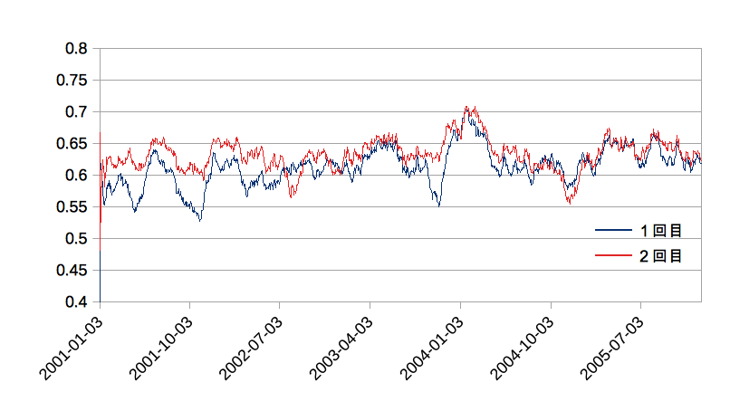
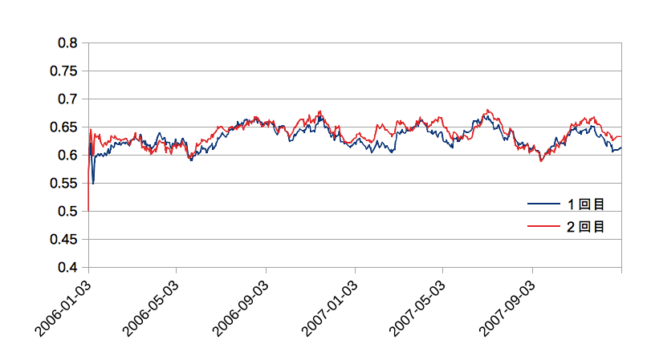

opf_binary_option
---

## モデル
### high/low直接予想モデル
+ 入力: open, close, high, low
+ 出力: low_value, low_value_delta, high_low
+ encoder
  + type: delta
  + n: 1000
  + w: 21
  + min/max : 0.0/2.0 
+ sp/tp/classifier
  + これらはswarmが出した値そのままで.
+ reset : 10 step毎

## 評価方法
###  データ
+ 学習用データ
  + 2001 - 2005年時間単位のヒストリカルデータ
+ validation用データ
  + 2006 - 2007年時間単位のヒストリカルデータ

### 評価内容
+ 学習
  + 2001 - 2005年の学習過程において, 評価指標の変化を確認する.
  + 計３回学習を行う.
+ 汎化
  + 2006 - 2007年のデータで予測を行い, 評価指標の変換を確認する.
  + 学習は止めた状態で実行する.
  + 2001-2005の学習の間にも, このデータによる予測を行う.

### 評価指標
+ anomaly
  + TPにおいてセルの発火が予測された割合.
+ predict reate
  + 正しいhigh/lowが予測された割合.
  + その時刻から30日前までのデータの平均.

## 結果
### 学習
+ [1回目](result/direct_2001_2005_1.csv)
  + 結果を抜粋
   | step  | 時刻                | predict rate | anomaly |
   | ---   | ---                 | ---          | ---     |
   | 6038  | 2001-12-28 20:00:00 | 0.6089       | 1.0000  |
   | 12126 | 2002-12-30 22:00:00 | 0.6047       | 0.9000  |
   | 18213 | 2003-12-30 22:00:00 | 0.6602       | 0.1500  |
   | 24380 | 2004-12-30 22:00:00 | 0.6227       | 0.3500  |
   | 30568 | 2005-12-30 21:00:00 | 0.6172       | 0.0000  |

+ [2回目](result/direct_2001_2005_2.csv)
  + 結果を抜粋. 1回目とほとんど変わらないように見える.
    | step  | 時刻                | predict rate | anomaly |
    | ---   | ---                 | ---          | ---     |
    | 6038  | 2001-12-28 20:00:00 | 0.6519       | 0.4500  |
    | 12126 | 2002-12-30 22:00:00 | 0.6006       | 1.0000  |
    | 18213 | 2003-12-30 22:00:00 | 0.6602       | 0.1000  |
    | 24380 | 2004-12-30 22:00:00 | 0.6089       | 0.0500  |
    | 30568 | 2005-12-30 21:00:00 | 0.6227       | 0.0000  |

+ グラフ

+ 結果
  + 1回目の2001年後半の段階で既に0.60に達している.
  + その後, 2003年に0.66まで上がるものの, その後, 0.6 - 0.62間で推移している.
  + 2回目でも同様の傾向が見られものの, 結果は1回目とほぼ同じ状態となっている.

### 汎化
+ [1回目](result/direct_2006_2007_1.csv)
  + 結果を抜粋
   | step  | 時刻                | predict rate | anomaly |
   | ---   | ---                 | ---          | ---     |
   | 6141  | 2006-12-29 21:00:00 | 0.6186       | 0.4500  |
   | 12284 | 2007-12-30 23:00:00 | 0.6103       | 1.0000  |

+ [2回目](result/direct_2006_2007_2.csv)
  + 結果を抜粋
   | step  | 時刻                | predict rate | anomaly |
   | ---   | ---                 | ---          | ---     |
   | 6141  | 2006-12-29 21:00:00 | 0.6255       | 0.3000  |
   | 12284 | 2007-12-30 23:00:00 | 0.6325       | 0.7000  |

+ グラフ

+ 結果
  + 1回目と2回目を比べると, 多少結果が向上していることが分かるが, それほど大きな差ではない.

## 考察
+ なぜ学習回数を重ねても, 結果が向上しないのか.
  + ほとんど0.6程度で頭打ちになってしまっている.

+ なぜ, 期間によって予測精度の良いところと悪いところが出てくるのか?
  + 2003年後半は0.66くらいまで上がるが, その他のところでは, 0.6 - 0.62付近の値となっている. 

